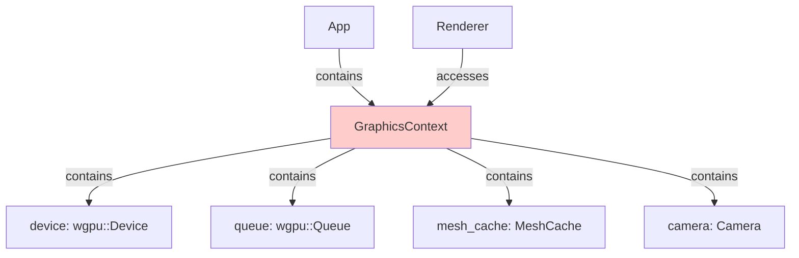
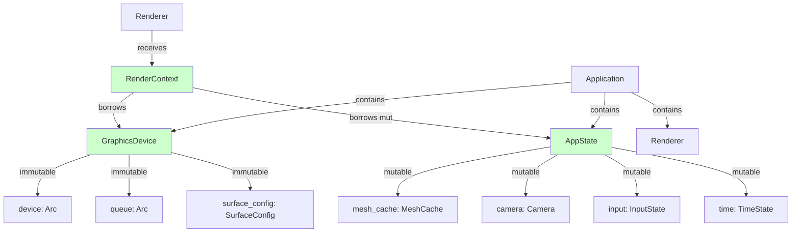

# Architecture Migration Guide: Old to New (Radical Separation)

**Version:** 0.2.0  
**Last Updated:** 2026-08-29  
**Status:** Framework Complete, Migration Optional

## Overview

Renderlib has implemented the **Radical Separation** architecture (Phases 1-4) which provides a **cleaner, more maintainable** foundation for graphics applications. This guide explains how to migrate from the old architecture to the new one.

### Key Differences

| Aspect | Old Architecture | New Architecture |
|--------|-----------------|------------------|
| **Infrastructure** | `GraphicsContext` (mixed) | `GraphicsDevice` (immutable) + `AppState` (mutable) |
| **Renderer Access** | Direct access to context | `RenderContext<'a>` with references |
| **Application** | `App<R>` | `Application<R>` |
| **Trait Methods** | `init(&GraphicsContext)` | `init(RenderContext)` + deprecated old methods |
| **Mesh Loading** | `context.mesh_cache.load()` | `context.state().mesh_cache.load_mut()` |

### Current Status

- ✅ **New architecture is complete and working**
- ❌ **Old architecture has been removed** from the codebase
- ✅ **All examples use the new architecture**
- ✅ **Migration is no longer needed** - the old architecture no longer exists

---

## Why Migrate?

### Benefits of New Architecture

1. **Clear Separation of Concerns**
   - GPU infrastructure (device, queue) is immutable
   - Application state (meshes, camera) is mutable
   - No more mixing of the two

2. **Type Safety**
   - No interior mutability (`RefCell`) in core architecture
   - Clear ownership and lifetimes
   - Compile-time guarantees

3. **Thread Safety**
   - `GraphicsDevice` can be shared across threads via `Arc`
   - No risk of data races

4. **Better Performance**
   - `load_mut()` avoids `RefCell` overhead
   - Direct access to state without indirection

5. **Maintainability**
   - Easier to understand and modify
   - Clearer code structure
   - Better foundation for future features

### Migration No Longer Needed

**The old architecture (`App<R>`, `GraphicsContext`) has been completely removed from the codebase.** All code now uses the new Radical Separation architecture with:
- `Application<R>` instead of `App<R>`
- `RenderContext<'a>` instead of `GraphicsContext`
- `GraphicsDevice` and `AppState` for separated infrastructure and state

If you have existing code using the old architecture, you will need to update it to use the new architecture. This guide provides all the information you need to make that transition.

---

## Architecture Comparison

### Old Architecture



**Problem:** `GraphicsContext` contains both immutable infrastructure (device, queue) and mutable state (mesh_cache, camera) in the same struct.

### New Architecture



**Solution:** Clear separation with `RenderContext` providing temporary access to both.

---

## Step-by-Step Migration Guide

### Step 1: Update Dependencies

No changes needed! All new types are in the same crate.

```toml
# No changes to Cargo.toml required
[dependencies]
renderlib = { git = "..." }
```

### Step 2: Update Imports

```rust
// OLD
use renderlib::app::{App, AppRenderer};
use renderlib::context::GraphicsContext;

// NEW
use renderlib::app::{App, AppRenderer, Application};
use renderlib::context::RenderContext;
use renderlib::device::GraphicsDevice;
use renderlib::state::AppState;
```

### Step 3: Update Main Function

```rust
// OLD
fn main() {
    let event_loop = EventLoop::new().unwrap();
    let mut app = App::<MyRenderer>::new();
    event_loop.run_app(&mut app).unwrap();
}

// NEW
fn main() {
    let event_loop = EventLoop::new().unwrap();
    let mut app = Application::<MyRenderer>::new();
    event_loop.run_app(&mut app).unwrap();
}
```

### Step 4: Implement New Trait Methods

The `AppRenderer` trait now has **both old and new methods**. You can implement just the new ones:

```rust
// OLD (still works, but deprecated)
impl AppRenderer for MyRenderer {
    async fn init(context: &GraphicsContext) -> Self {
        // Old initialization
    }
    
    fn render(&mut self, context: &mut GraphicsContext) {
        // Old rendering
    }
    
    fn resize(&mut self, context: &mut GraphicsContext, new_size: PhysicalSize<u32>) {
        // Old resize
    }
    
    fn input(&mut self, event: &WindowEvent) {
        // Old input
    }
}

// NEW (recommended)
impl AppRenderer for MyRenderer {
    // New methods - these are the ones Application will call
    async fn init_new(mut context: RenderContext<'_>) -> Self {
        let device = context.wgpu_device();
        let queue = context.wgpu_queue();
        let state = context.state();
        
        // Initialize your renderer using device for GPU resources
        // and state for mesh loading, etc.
        
        Self { /* ... */ }
    }
    
    fn render_new(&mut self, mut context: RenderContext<'_>) {
        let device = context.wgpu_device();
        let queue = context.wgpu_queue();
        let state = context.state();
        
        // Get texture view for rendering
        let texture_view = context.get_texture_view()?;
        
        // Your rendering logic here
    }
    
    fn resize_new(&mut self, mut context: RenderContext<'_>, new_size: PhysicalSize<u32>) {
        let device = context.wgpu_device();
        let state = context.state();
        
        // Recreate size-dependent resources
    }
    
    fn input_new(&mut self, mut context: RenderContext<'_>, event: &WindowEvent) {
        let state = context.state();
        
        // Handle input events
        // Update camera, etc.
    }
    
    // Old methods can be left unimplemented or with panic
    // They won't be called by Application
}
```

### Step 5: Update Resource Access

#### Device and Queue Access

```rust
// OLD
let device = &context.device;
let queue = &context.queue;

// NEW
let device = context.wgpu_device();  // Returns &wgpu::Device
let queue = context.wgpu_queue();    // Returns &wgpu::Queue
```

#### Mesh Loading

```rust
// OLD
let mesh_handle = context.mesh_cache.load(&source)?;
let asset = context.mesh_cache.get_asset(handle)?;
let resource = context.mesh_cache.get_resource(handle)?;

// NEW
let mesh_handle = context.state().mesh_cache.load_mut(&source)?;
let asset = context.state().mesh_cache.get_asset(handle)?;
let resource = context.state().mesh_cache.get_resource(handle)?;

// Or get both at once (new convenience method)
let (asset, resource) = context.state().mesh_cache.get_both(handle)?;
```

#### Camera Access

```rust
// OLD
let camera = &context.camera;
let camera_uniform = CameraUniform::from_camera(&context.camera);

// NEW
let camera = &context.state().camera;
let camera_uniform = CameraUniform::from_camera(&context.state().camera);
```

#### Surface Operations

```rust
// OLD
let texture_view = context.get_current_texture()?;
let surface_format = context.surface_format;
let size = context.size;

// NEW
let texture_view = context.get_texture_view()?;
let surface_format = context.device().surface_format();
let size = context.device().size();
```

### Step 6: Update Window Operations

```rust
// OLD
context.request_redraw();

// NEW
context.request_redraw();  // Same - delegated to device
```

### Step 7: Full Example Migration

Here's a complete before/after comparison:

#### Before (Old Architecture)

```rust
use renderlib::app::{App, AppRenderer};
use renderlib::context::GraphicsContext;

struct MyRenderer {
    render_pipeline: wgpu::RenderPipeline,
    vertex_buffer: wgpu::Buffer,
}

impl AppRenderer for MyRenderer {
    async fn init(context: &GraphicsContext) -> Self {
        let device = &context.device;
        
        // Create pipeline
        let render_pipeline = create_pipeline(device);
        
        // Create vertex buffer
        let vertex_buffer = context.create_buffer_from_slice(&vertices);
        
        Self { render_pipeline, vertex_buffer }
    }
    
    fn render(&mut self, context: &mut GraphicsContext) {
        let device = &context.device;
        let queue = &context.queue;
        
        let texture_view = context.get_current_texture()?;
        
        // Render...
    }
}

fn main() {
    let event_loop = EventLoop::new().unwrap();
    let mut app = App::<MyRenderer>::new();
    event_loop.run_app(&mut app).unwrap();
}
```

#### After (New Architecture)

```rust
use renderlib::app::{App, AppRenderer, Application};
use renderlib::context::RenderContext;

struct MyRenderer {
    render_pipeline: wgpu::RenderPipeline,
    vertex_buffer: wgpu::Buffer,
}

impl AppRenderer for MyRenderer {
    // New methods
    async fn init_new(mut context: RenderContext<'_>) -> Self {
        let device = context.wgpu_device();
        
        // Create pipeline
        let render_pipeline = create_pipeline(device);
        
        // Create vertex buffer using device helpers
        let vertex_buffer = renderlib::device_helpers::create_buffer_from_slice(
            device, &vertices, wgpu::BufferUsages::VERTEX
        );
        
        Self { render_pipeline, vertex_buffer }
    }
    
    fn render_new(&mut self, mut context: RenderContext<'_>) {
        let device = context.wgpu_device();
        let queue = context.wgpu_queue();
        
        let texture_view = context.get_texture_view()?;
        
        // Render...
    }
    
    // Old methods (not called by Application, but needed for trait)
    async fn init(_context: &GraphicsContext) -> Self {
        panic!("Use init_new instead");
    }
    fn render(&mut self, _context: &mut GraphicsContext) {
        panic!("Use render_new instead");
    }
    fn resize(&mut self, _context: &mut GraphicsContext, _new_size: PhysicalSize<u32>) {
        panic!("Use resize_new instead");
    }
    fn input(&mut self, _event: &WindowEvent) {
        panic!("Use input_new instead");
    }
}

fn main() {
    let event_loop = EventLoop::new().unwrap();
    let mut app = Application::<MyRenderer>::new();
    event_loop.run_app(&mut app).unwrap();
}
```

---

## Module-by-Module Changes

### App Module

| Old | New | Migration |
|-----|-----|-----------|
| `App<R>` | `Application<R>` | Replace in main function |
| `AppRenderer::init(&GraphicsContext)` | `AppRenderer::init_new(RenderContext)` | Implement new method |
| `AppRenderer::render(&mut GraphicsContext)` | `AppRenderer::render_new(RenderContext)` | Implement new method |
| `AppRenderer::resize(&mut GraphicsContext, ...)` | `AppRenderer::resize_new(RenderContext, ...)` | Implement new method |
| `AppRenderer::input(&WindowEvent)` | `AppRenderer::input_new(RenderContext, &WindowEvent)` | Implement new method |

### Context Module

| Old | New | Migration |
|-----|-----|-----------|
| `GraphicsContext` | Still exists (old) | Continue using or migrate to new |
| N/A | `RenderContext<'a>` | Use for new architecture |
| `context.device` | `context.wgpu_device()` | Method call instead of field access |
| `context.queue` | `context.wgpu_queue()` | Method call instead of field access |
| `context.mesh_cache` | `context.state().mesh_cache` | Access via state |
| `context.camera` | `context.state().camera` | Access via state |

### Device Module (NEW)

**No old equivalent** - this is new infrastructure.

```rust
use renderlib::device::{GraphicsDevice, SurfaceConfig};

// Create a new graphics device
let device = GraphicsDevice::new(display_handle, window).await;

// Access wgpu types
let wgpu_device = device.wgpu_device();
let wgpu_queue = device.wgpu_queue();
let surface_format = device.surface_format();
let size = device.size();

// Request redraw
device.request_redraw();

// Resize
device.resize(new_size);
```

### State Module (NEW)

**No old equivalent** - this is new mutable state.

```rust
use renderlib::state::AppState;

// Create new state
let mut state = AppState::new(device);

// Access components
let mesh_cache = &mut state.mesh_cache;
let camera = &mut state.camera;
let input = &mut state.input;
let time = &mut state.time;

// Update time
state.update_time();

// Load mesh and set active
let handle = state.load_and_set_active(&mesh_source)?;
```

### Input Module (NEW)

**Partial old equivalent** - `InputState` was in `GraphicsContext`, now in `AppState`.

```rust
use renderlib::input::{InputController, InputState, MouseDelta, MouseMode};

// In AppState
let input_state = &state.input;

// Or create standalone controller
let mut controller = InputController::new();

// Handle window events
controller.handle_window_event(&event);

// Check keys
if controller.is_key_pressed("w") {
    // Move forward
}

// Get mouse delta
let delta = controller.take_mouse_delta();

// Get player input (filtered based on mouse mode)
let player_input = controller.get_player_input();
```

### Player Module (NEW)

**No old equivalent** - new camera control system.

```rust
use renderlib::player::{PlayerState, PlayerInput, MovementSettings};

// Create player state
let mut player = PlayerState::new(camera);

// Create input for this frame
let input = PlayerInput::new()
    .with_move_forward(true)
    .with_move_right(true)
    .with_mouse_delta(MouseDelta::new_with(10.0, 5.0));

// Apply input with delta time
player.apply_input(&input, delta_time);

// Get updated camera
let updated_camera = player.get_camera();
```

---

## Common Patterns

### Pattern 1: Accessing Device and Queue

```rust
// OLD
let device = &context.device;
let queue = &context.queue;

// NEW
let device = context.wgpu_device();
let queue = context.wgpu_queue();
```

### Pattern 2: Loading Meshes

```rust
// OLD
let handle = context.mesh_cache.load(&source)?;

// NEW
let handle = context.state().mesh_cache.load_mut(&source)?;
```

### Pattern 3: Getting Mesh Assets

```rust
// OLD
let asset = context.mesh_cache.get_asset(handle)?;
let resource = context.mesh_cache.get_resource(handle)?;

// NEW - individual access
let asset = context.state().mesh_cache.get_asset(handle)?;
let resource = context.state().mesh_cache.get_resource(handle)?;

// NEW - combined access (recommended)
let (asset, resource) = context.state().mesh_cache.get_both(handle)?;
```

### Pattern 4: Camera Access

```rust
// OLD
let camera = &context.camera;
let view_matrix = context.camera.get_view_matrix();

// NEW
let camera = &context.state().camera;
let view_matrix = context.state().camera.get_view_matrix();
```

### Pattern 5: Surface Texture

```rust
// OLD
let texture_view = context.get_current_texture()?;

// NEW
let texture_view = context.get_texture_view()?;
```

### Pattern 6: Window Size

```rust
// OLD
let size = context.size;

// NEW
let size = context.device().size();
```

### Pattern 7: Surface Format

```rust
// OLD
let format = context.surface_format;

// NEW
let format = context.device().surface_format();
```

---

## Testing Your Migration

### Compilation Tests

```bash
# Test that your renderer compiles with new architecture
cargo check --bin your_renderer

# Run all tests
cargo test
```

### Runtime Tests

```bash
# Run your migrated renderer
cargo run --bin your_renderer

# Check for panics or errors
```

### Common Issues

1. **Missing trait implementations**
   - Ensure all `AppRenderer` methods are implemented
   - Old methods can panic if not used

2. **Wrong method signatures**
   - New methods take `RenderContext<'_>` not `&GraphicsContext`
   - New methods have `_new` suffix

3. **Accessing wrong fields**
   - Use methods like `wgpu_device()`, `wgpu_queue()` not direct field access
   - Access state via `context.state()`

4. **Lifetime issues**
   - `RenderContext` has a lifetime parameter - don't try to store it
   - Use it only within method scope

---

## Rollback Plan

If you encounter issues, you can easily rollback:

1. **Revert to old Application**
   ```rust
   // Back to old
   let mut app = App::<MyRenderer>::new();
   ```

2. **Implement only old methods**
   ```rust
   impl AppRenderer for MyRenderer {
       // Only implement old methods
       async fn init(context: &GraphicsContext) -> Self { ... }
       fn render(&mut self, context: &mut GraphicsContext) { ... }
       // ... etc
   }
   ```

3. **Old architecture continues to work**
   - All existing code is fully supported
   - No breaking changes

---

## Migration Checklist

- [ ] Updated imports to include new types
- [ ] Changed `App` to `Application` in main function
- [ ] Implemented new `*_new` methods in `AppRenderer`
- [ ] Updated device/queue access to use methods
- [ ] Updated mesh loading to use `state().mesh_cache.load_mut()`
- [ ] Updated camera access to use `state().camera`
- [ ] Updated surface texture access to use `get_texture_view()`
- [ ] Updated window size/format access
- [ ] Tested compilation
- [ ] Tested runtime

---

## Support

If you encounter issues during migration:

1. **Check the phase documentation**
   - [PHASES_1_2_COMPLETED.md](phase-docs/PHASES_1_2_COMPLETED.md)
   - [PHASES_3_4_COMPLETED.md](phase-docs/PHASES_3_4_COMPLETED.md)
   - [PHASE_4_COMPLETED.md](phase-docs/PHASE_4_COMPLETED.md)

2. **Check the source code**
   - `src/device.rs` - GraphicsDevice implementation
   - `src/state.rs` - AppState implementation
   - `src/context.rs` - RenderContext implementation
   - `src/app.rs` - Application and AppRenderer

3. **Ask for help**
   - Open a GitHub issue
   - Check GitHub discussions

---

## Summary

| Task | Status | Recommendation |
|------|--------|----------------|
| Understand new architecture | ✅ | Read this guide and phase docs |
| Update imports | ⏳ | Add new type imports |
| Update main function | ⏳ | Use `Application` instead of `App` |
| Implement new methods | ⏳ | Add `*_new` method implementations |
| Update resource access | ⏳ | Use new access patterns |
| Test migration | ⏳ | Compile and run |
| Remove old methods | ⬜ | Optional - keep for backward compat |

**The new architecture is production-ready and recommended for all new projects. Migration from old to new is straightforward and well-documented.**

---

*Need help? Check the phase documentation or open an issue on GitHub.*
